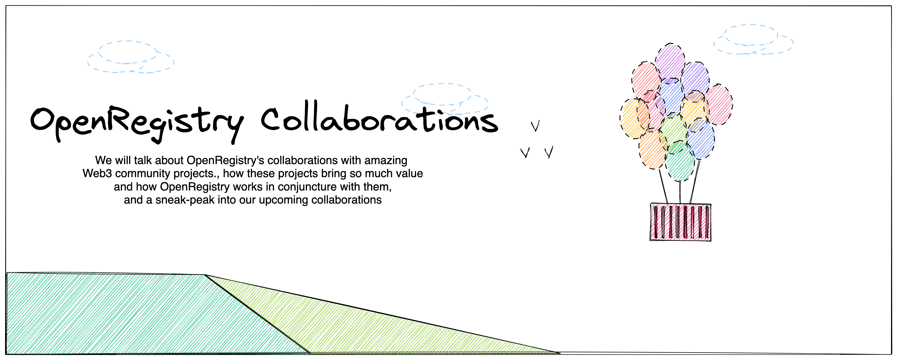

# OpenRegistry and Collaborations with Community Projects

    <User styles="w-6 h-6"/>
    Guacamole | MAR 25 2022 | 5 min Read

>A breath of our inspiration  
Is the life of each generation;  
A wondrous thing of our dreaming  
Unearthly, impossible seeming —  
The soldier, the king, and the peasant  
Are working together in one,  
Till our dream shall become their present,  
And their work in the world be done.

						 - Ode, O'Shaughnessy

OpenRegistry is about the work done together. We were first just an idea which lead into developing a project to win 
Hackathon. It was the collaboration (with Akash, Skynet and among ourselves) that kept pushing us to develop 
OpenRegistry with determination we are able to build OpenRegitry with full force.

Under <a href="https://github.com/containerish" target="_blank">Containerish</a>, OpenRegistry is an initiative towards Web 3.0. 
To build decentralised applications and develop tool-chains to support Web 3.0 Teams and Communities.
We have so far collaborated with Akash Network & Skynet. We working on collaborating with IPFS and Filebase. 
Containerish should become a hub of collaborations as there come more projects like OpenRegistry.

## Akash Network
Akash Network is a distributed marketplace for cloud compute. The beginning of OpenRegistry was with Akash.
We worked hand in hand with Akash Network to deploy OpenRegistry and explore possibilities of making the developer experience 
seamless. Akash Network hosted a Hackathon in July of 2021 called Open Cloud challenge in collaboration with Skynet, 
where OpenRegistry was the winner, 
check their <a href="https://akash.network/blog/everyone-s-a-winner-in-the-sovrynthon-hackathon-sponsored-by-akash" target="_blank">blog</a> 
for more details.

Shortly after, we engaged with CAB (Community Awards Board) at Akash Network for a grant funding to continue developing OpenRegistry.
Following are the individual posts:
- <a href="https://forum.akash.network/t/openregistry-an-open-container-registry/76" class="text-blue-900 underline" target="_blank">OpenRegistry - an Open Container Registry</a>
- <a href="https://forum.akash.network/t/openregistry-an-open-and-reliable-container-registry/515" class="text-blue-900 underline" target="_blank">OpenRegistry - Beta Registration</a>
- <a href="https://forum.akash.network/t/openregistry-community-proposal/684" class="text-blue-900 underline" target="_blank">OpenRegistry - Community Proposal</a>
- <a href="https://forum.akash.network/t/openregistry-is-now-oci-certified/3317" class="text-blue-900 underline" target="_blank">OpenRegistry - OCI Certification</a>
- <a href="https://forum.akash.network/t/openregistry-product-update/3745" class="text-blue-900 underline" target="_blank">OpenRegistry - Roadmap</a>

Akash community continues to support OpenRegistry through CAB and active community members on each step helping us achieve 
our milestone as mentioned in our <a href="https://forum.akash.network/t/openregistry-product-update/3745" target="_blank">Roadmap</a>.
With new Persistent storage feature, Akash has made it even more reliable to host applications without having to worry 
about losing your deployments.
We are all but thankful for Akash and their solid companionship.  

## Sia Skynet

Skynet is a decentralised hosting platform aka Airbnb for Data Storage. The Skynet code is open source and they take 
care of encrypting your files and breaking them into pieces which are then stored on servers all over then world without a 
central entity controlling anything.
OpenRegistry uses Skynet as it's storage layer. All of the static contents for our web-app in addition to all of the container images are stored on Skynet.
With Skynet we have been able to maintain 98%+ up-time for OpenRegistry Web-App.
Check <a href="https://status.openregistry.dev/" target="_blank">OpenRegistry - status</a> for details.

* with Skynet, OpenRegsitry only stores skylinks (which are content hashes) of your container images.

In addition to collaboration, we are also maintaining a fork of Skynet-Go SDK since OpenRegsitry is developed in Go and 
the  same Skynet-Go SDK can be used by other developers as we continue to update it.

With more adoption and use, OpenRegistry is moving towards accomplishing it's Goal which is to make OpenRegistry free for everyone.

## Collaborations in Progress

As OpenRegistry grows in code and in community's hearts, we are working on collaborating with more awesome projects out there. 
The first in our list is Filebase. Through Filebase: We will be able to connect with multiple decentralised storage 
networks which means collaboration with more platforms.

We are also planning on collaborating with IPFS to bring the powerful Interplanetary File System to OpenRegistry.

## Collaborate with OpenRegistry

We would love to hear from you. OpenRegistry is Open to register new developers and collaborators. 
If you think our projects (yours and ours) have common goals and can do well together, <a href="mailto:team@openregsitry.dev" target="_blank">write to us</a>. 
If you wish to contribute to OpenRegistry code-base check out our <a href="https://github.com/containerish/openregistry" target="_blank">Github</a>. There are number of issues to contribute to and issue templates 
in place for smooth issue submission. There is also <a href="https://github.com/containerish/OpenRegistry/discussions/55" target="_blank">github discussions</a> 
where you can start a discussion for enhancements and making OpenRegistry better.

OpenRegistry code is Open Source and is going to stay Open Source . We will start incentivising the individual contributions soon.

---

##

