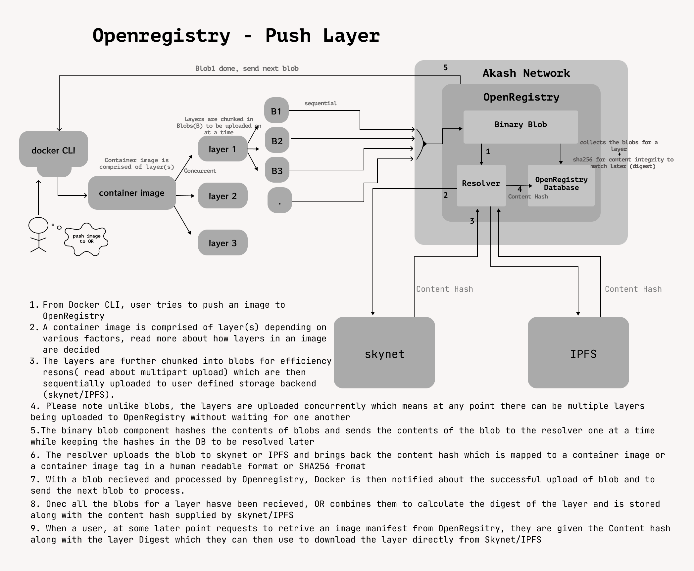

# OpenRegistry Overview

    <User styles="w-6 h-6"/>
    Guacamole | MAR 25 2022 | 5 min Read

I would like to start with a little background of how I came to be in tech and ended up being a part of OpenRegistry - 
a Distributed and OpenSource container registry.
I am a computer science graduate (graduated in 2015) from a small town in central region of India. 
I straight off started working in a corporate firm(at 20) after graduation thinking it's the best place to be. 
I had little to no guidance which ended up in multiple bad career choices and worse mental health since I did not 
enjoy working in Networking Support, Incident Management and fixing Routers/Switches.

A little bit interest I had in Networking was taken away by the bad management from one org to another which only 
got worse with each shift over 5 years.
Then Covid happened and brought WFH which gave me so much time to explore and learn new things 
(since I didn't have to travel 3 hours to office everyday). I started learning a programming language(Go) and solving 
competitive coding problems.
This is when I realized, I was not meant to be a Support Representative.
Along the same time, I met someone so wonderful that helped me thrive even more in the field.
Well now enough about me, let's talk about OpenRegistry!

OpenRegistry started off as a fun project by my partner when he read a 
tweet by <a href="https://twitter.com/gregosuri" target="_blank">Greg Osuri</a>(CEO at Akash Network)
which said, they'd reward anyone who'd build a container registry on Akash. This sparked a light in a developer
(my partner) and he started putting a few hours everyday in building what is now OpenRegistry. After a short while, 
there came a Hackathon on Akash which motivated him even more to accelerate the work and present it for the Hackathon. 
We joined forces and started working on it together and submitted our first working prototype in Hackathon and we WON! yayy!!

We continued to work on OpenRegistry because at this point it was more than just rewards or a Hackathon to win.

## Technicality

### Backend:

Let's dive into the Technical parts of how OpenRegistry came to life.
The OpenRegistry backend is written in Go with echo framework which is the most abstract and user-friendly framework.
We needed a quick to build working prototype and only for those reasons we decided to go with echo.
However, we'll be working on replacing it entirely with a better or no framework for performance and efficiency reasons.

### WebApp:

The WebApp was previously written with React and JavaScript and is now being replaced with SvelteKit and TypeScript 
which will definitely make it more efficient and fast.
 We are also using a large amount of Tailwind CSS components which are lightweight and super simple to use.
The new WebApp contains a beautiful series of illustrations by <a href="https://2.flexiple.com/scale/home" target="_blank">flexiple</a>, 
fresh color palette and a brandNew Logo. 

### Database:

The Database layer was previously written with Badger which is simple to use key value store and fast like a cache. 
However for scaling and data organization, we have migrated to PostgreSQL database. We are planning to keep using badger 
for operations that are very frequent. Alongside this, we have tried to make an effort for future DB migrations to be
simple, quick and with zero code changes. This can be achieved by abstracting the database operations in OpenRegistry to an interface. 
Any new database like MongoDB could be implemented and used by just satisfying the storage interface with ease and no changes in existing code.

### Hosting and Storage:

OpenRegistry uses Akash Network as it's compute layer and Skynet as Storage layer.
OpenRegistry database only stores the skylinks to the actual container images thus 
ensuring complete privacy.

## What's Next for OpenRegistry?

There are great many thing we would want to introduce in and around OpenRegistry to build a complete ecosystem for 
public goods. We want to be more involved in community projects aside from our daily jobs and provide high quality service 
content as our contribution to community. Our goal is to make OpenRegistry Free for everyone which can be achieved with 
higher adoption by community projects and open source developers.

### WebAuthN

WebAuthN is relatively a newer standard for Authenticating users in your applications. It's a WWW standard and is 
supported in all latest versions of popular browsers.It is as simple as logging into your computer with Windows Hello or 
Apple’s Touch ID.It works much like Public-Private Key Authentication. It also encourage privacy of user data, since with 
WebAuthN we don't need to store Username, Email, Password, etc to identify a user. They simply process a cryptographic signature,
and on success they prove to be the owners of a particular account/identity.
To read more about Web AuthN <a href="https://webauthn.guide/" target="_blank">here</a>

### Encrypted & Private Container Images

Private container images are one of the most sought after features of a Container Registry. OpenRegistry does provide consistent hashing system for validating the contents of a container image but with encryption, this can be taken forward to the next level.
One of the major advantages of encrypted container images is that you can control the accessibility to be limited to a particular group or organization. This means you can ship confidential code, or patented work within container images without having to think about it being stolen or misused. Even if such a container image comes in hand of malicious user, they will not be able to read or decrypt the contents of the container image.

OpenRegistry will support popular cryptographic methods like Rivest-Shamir-Adleman (RSA), Elliptic Curve, and Advanced Encryption Standard (AES) and the encryption keys (private keys) will never leave the user (at least they won't be shared with OpenRegistry). There are tools available in the market to encrypt container images on client-side and upload them to container registries.

### Platform Agnostic Security Tokens

Platform Agnostic Security Tokens or PASETO are a safe alternative to JSON Web Tokens (JWTs). JWT's were never mean to be used as long-term credentials. Using JWTs as short-lived (5-10 mins) credentials is ideal but with a Container Registry, it makes sense to have long lived credentials. They're very limited in scope and are used under secure contexts. Learn more about PASETO <a href="https://github.com/paseto-standard/paseto-spec" target="_blank">here</a>

### Org Mode

Org mode will enable you to create and manage oragnizations within OpenRegistry. You can think of Org Mode as Github Organizations.
This will let you manage a team or teams easily through org wide scopes, permissions and ACLs. Initially, Org Mode will include the following features:
- Create & manage organizations 
- User Management within the Org
- Fine grained scopes and permissions

And many more features like **P2P Container Image Distribution**, **Desktop Application** to manage & work with containers locally and **Container Runtime** with Memeory Safety and tons of security improvements than the ones available today.

But *hey*, let's talk about them in our next post?

##
